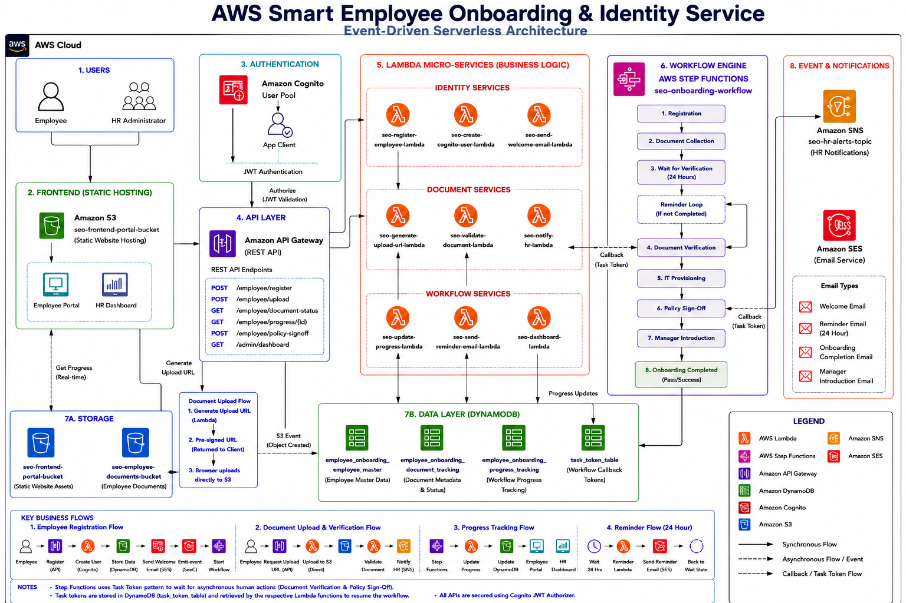
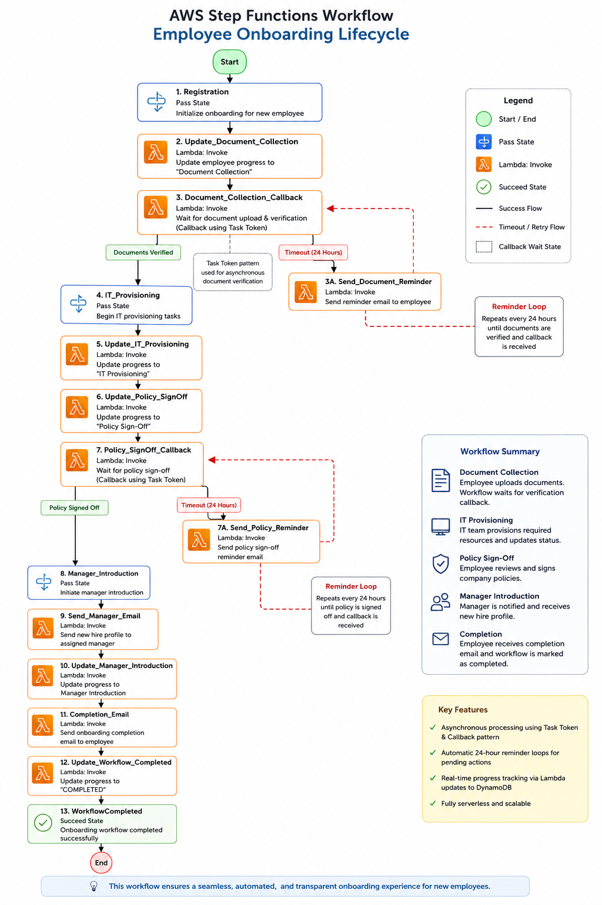
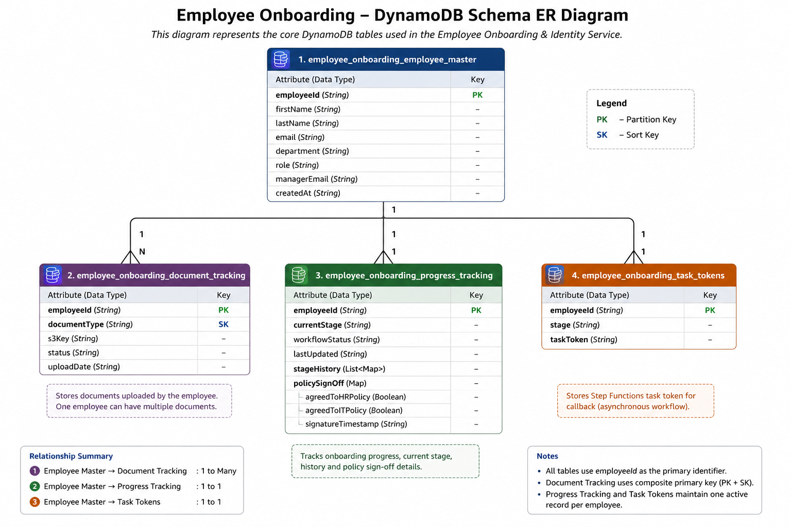

# AWS Smart Employee Onboarding & Identity Service

> **An event-driven, serverless employee onboarding platform built on AWS to automate employee identity management, document collection, workflow orchestration, and real-time onboarding progress tracking using fully managed cloud services.**

---

## Table of Contents

- [Project Overview](#project-overview)
- [Problem Statement](#problem-statement)
- [Solution Overview](#solution-overview)
- [System Architecture](#system-architecture)
- [Architecture Diagram](#architecture-diagram)
- [Step Functions Workflow](#step-functions-workflow)
- [AWS Services Used](#aws-services-used)
- [Key Features](#key-features)
- [Project Workflow](#project-workflow)
- [Callback Pattern & Task Tokens](#callback-pattern--task-tokens)
- [Database Design](#database-design)
- [API Endpoints](#api-endpoints)
- [Contributors](#contributors)

---

## Project Overview

The **AWS Smart Employee Onboarding & Identity Service** is an event-driven, serverless application designed to automate and streamline the complete employee onboarding lifecycle. The solution replaces manual onboarding processes with an intelligent workflow that manages employee registration, identity creation, secure document collection, progress tracking, policy acknowledgements, and onboarding completion through a fully managed AWS architecture.

The application follows a serverless design using **AWS Lambda**, **AWS Step Functions**, **Amazon API Gateway**, **Amazon DynamoDB**, **Amazon Cognito**, **Amazon S3**, **Amazon SES**, and **Amazon SNS** to provide a scalable, secure, and highly available onboarding platform. Each stage of the onboarding process is orchestrated through AWS Step Functions, enabling asynchronous execution, automated state management, reminder notifications, and real-time progress tracking.

The system provides two dedicated web interfaces:

- **Employee Portal** – Allows employees to securely upload required documents, monitor onboarding progress, complete policy acknowledgements, and track their onboarding status in real time.
- **HR Dashboard** – Enables HR administrators to register employees, monitor onboarding progress across the organization, verify submitted documents, and manage onboarding activities from a centralized dashboard.

The project demonstrates modern cloud-native application development by combining event-driven architecture, serverless computing, workflow orchestration, secure authentication, and managed AWS services into a single end-to-end onboarding solution.

---

## Tech Stack

| Category | Technologies |
|----------|--------------|
| **Cloud Platform** | Amazon Web Services (AWS) |
| **Programming Language** | Python |
| **Frontend** | HTML5, CSS3, JavaScript |
| **Backend** | AWS Lambda, REST APIs |
| **Workflow Orchestration** | AWS Step Functions |
| **Database** | Amazon DynamoDB |
| **Authentication** | Amazon Cognito |
| **Storage** | Amazon S3 |
| **API Management** | Amazon API Gateway |
| **Email Service** | Amazon SES |
| **Notification Service** | Amazon SNS |
| **Architecture** | Serverless, Event-Driven, Callback Pattern, Task Tokens |

---

## Problem Statement

Employee onboarding is often a manual and time-consuming process that involves multiple departments, repetitive communication, document verification, identity provisioning, and policy acknowledgements. Traditional onboarding workflows commonly rely on emails, spreadsheets, and manual follow-ups, making it difficult for HR teams to track progress and ensure that every onboarding task is completed on time.

These manual processes introduce several challenges:

- Delays in employee registration and identity creation.
- Lack of centralized visibility into onboarding progress.
- Manual document collection and verification.
- Inefficient follow-up for pending employee actions.
- Difficulty coordinating onboarding activities across HR, IT, and employees.
- Increased risk of human error due to disconnected systems.

To address these challenges, an automated onboarding solution is required that can orchestrate the complete onboarding lifecycle, securely manage employee data, provide real-time progress tracking, automate notifications and reminders, and reduce manual intervention through an event-driven serverless architecture.

---

## Solution Overview

The AWS Smart Employee Onboarding & Identity Service addresses the limitations of traditional onboarding by implementing a fully automated, event-driven workflow using AWS serverless services. The solution orchestrates each stage of the onboarding process, ensuring that employee activities are completed in the correct sequence while providing real-time visibility into onboarding progress.

The onboarding process begins when an HR administrator registers a new employee through the HR Dashboard. The system automatically generates a unique employee identifier, provisions a secure user account in Amazon Cognito, sends a welcome email containing onboarding instructions, and initiates an AWS Step Functions workflow to manage the employee's onboarding journey.

Employees interact with the Employee Portal to upload required documents, monitor their onboarding status, and complete mandatory policy acknowledgements. Uploaded documents are securely stored in Amazon S3, while metadata and onboarding progress are maintained in Amazon DynamoDB.

AWS Step Functions act as the orchestration engine for the entire solution, coordinating workflow execution across multiple AWS Lambda functions. The workflow leverages the Callback Pattern with Task Tokens to pause execution while waiting for employee actions, allowing the system to resume automatically once the required task has been completed. Automated reminder emails are generated for pending actions, ensuring that onboarding progresses without continuous manual intervention.

By combining serverless computing, workflow orchestration, secure authentication, managed storage, and event-driven communication, the solution provides a scalable, secure, and maintainable platform that significantly reduces manual effort while improving the overall onboarding experience for both employees and HR administrators.

---

## System Architecture

The solution follows an **event-driven, serverless architecture** built entirely on AWS managed services. The architecture is designed to automate the complete employee onboarding lifecycle while minimizing operational overhead, improving scalability, and ensuring secure communication between system components.

The application consists of two client interfaces: the **Employee Portal** and the **HR Dashboard**. Both applications communicate with the backend through **Amazon API Gateway**, which serves as the single entry point for all REST API requests.

Business logic is implemented using **AWS Lambda** functions, where each function is responsible for a specific onboarding task such as employee registration, document processing, progress tracking, policy sign-off, email notifications, and dashboard data retrieval. This modular design allows each component to operate independently while maintaining a loosely coupled architecture.

The complete onboarding lifecycle is orchestrated by **AWS Step Functions**, which coordinate the execution of individual Lambda functions and manage workflow transitions between onboarding stages. The workflow utilizes the **Callback Pattern** with **Task Tokens** to pause execution until user-driven actions, such as document submission or policy acknowledgement, are completed.

Employee information, document metadata, and onboarding progress are stored in separate **Amazon DynamoDB** tables, providing fast, scalable, and highly available data storage. Uploaded documents are securely stored in **Amazon S3**, while **Amazon Cognito** manages employee authentication and secure access to the application.

The system also integrates **Amazon SES** to send welcome emails, reminder notifications, and onboarding completion emails, while **Amazon SNS** delivers document verification notifications to HR administrators. Together, these managed AWS services create a scalable, secure, and highly available onboarding platform capable of supporting asynchronous business processes with minimal operational management.

---

## Architecture Diagram

The following diagram illustrates the high-level architecture of the AWS Smart Employee Onboarding & Identity Service and the interaction between the AWS services used throughout the onboarding lifecycle.

<p align="center">
  
</p>

The architecture follows a serverless, event-driven design where all client requests are routed through Amazon API Gateway to AWS Lambda functions. AWS Step Functions orchestrate the complete onboarding workflow, coordinating employee registration, document collection, verification, IT provisioning, policy acknowledgements, and onboarding completion. Amazon DynamoDB stores application data, Amazon Cognito manages authentication, Amazon S3 stores uploaded documents and frontend assets, while Amazon SES and Amazon SNS handle email and notification services respectively.

---

## Step Functions Workflow

The employee onboarding lifecycle is orchestrated using **AWS Step Functions**, enabling reliable workflow execution, state management, and asynchronous processing. The workflow coordinates each onboarding stage, pauses execution when waiting for employee actions using the **Callback Pattern**, and automatically resumes once the required task is completed using **Task Tokens**.

<p align="center">
  
</p>

### Workflow Highlights

- Automates the complete employee onboarding lifecycle.
- Coordinates AWS Lambda functions across each onboarding stage.
- Implements the **Callback Pattern** with **Task Tokens** for asynchronous employee actions.
- Supports document collection, verification, IT provisioning, policy sign-off, manager introduction, and onboarding completion.
- Provides reliable state management, retries, and error handling for long-running workflows.

---

## AWS Services Used

| AWS Service | Purpose | Role in the Solution |
|-------------|---------|----------------|
| **Amazon API Gateway** | REST API Management | Serves as the single entry point for all frontend requests, routing HTTP APIs to the appropriate AWS Lambda functions. |
| **AWS Lambda** | Serverless Compute | Executes the business logic for employee registration, document processing, progress tracking, policy sign-off, reminder emails, and dashboard operations. |
| **AWS Step Functions** | Workflow Orchestration | Coordinates the complete employee onboarding lifecycle using state transitions, wait states, callback patterns, retries, and workflow management. |
| **Amazon DynamoDB** | NoSQL Database | Stores employee information, document metadata, and onboarding progress across three dedicated tables with low-latency access. |
| **Amazon Cognito** | Authentication & Authorization | Manages employee identities, user authentication, and secure access to the Employee Portal using Cognito User Pools. |
| **Amazon S3** | Object Storage | Stores uploaded employee documents securely and hosts the static frontend applications for both the Employee Portal and HR Dashboard. |
| **Amazon SES** | Email Service | Sends welcome emails, reminder notifications for pending onboarding tasks, and onboarding completion emails. |
| **Amazon SNS** | Notification Service | Delivers document verification notifications to HR administrators, enabling asynchronous communication between services. |
| **AWS IAM** | Access Management | Enforces least-privilege permissions for Lambda functions and secure service-to-service communication across the application. |

### Architecture Highlights

- **Serverless Architecture** – Eliminates server management by leveraging fully managed AWS services.
- **Event-Driven Workflow** – Automates onboarding through asynchronous events and workflow orchestration.
- **Workflow Orchestration** – AWS Step Functions coordinate each onboarding stage while maintaining workflow state.
- **Secure Authentication** – Amazon Cognito provides secure user authentication and access control.
- **Scalable Data Storage** – Amazon DynamoDB delivers highly available, low-latency storage for onboarding data.
- **Secure Document Management** – Employee documents are stored securely in Amazon S3 using organized object storage.
- **Automated Communication** – Amazon SES and Amazon SNS automate employee notifications and HR alerts.

---

## Key Features

- **Employee Registration & Identity Management**
  - Registers new employees through the HR Dashboard, generates a unique Employee ID, provisions user accounts in Amazon Cognito, and initiates the onboarding workflow.

- **Workflow Orchestration with AWS Step Functions**
  - Automates the complete onboarding lifecycle by coordinating each stage through a centralized workflow, ensuring tasks are executed in the correct sequence.

- **Secure Document Upload & Verification**
  - Allows employees to upload required onboarding documents securely to Amazon S3 while maintaining document metadata and verification status in Amazon DynamoDB.

- **Asynchronous Callback Pattern**
  - Implements the AWS Step Functions Callback Pattern with Task Tokens, enabling the workflow to pause while waiting for employee actions and resume automatically upon completion.

- **Real-Time Progress Tracking**
  - Maintains the current onboarding stage and workflow history in Amazon DynamoDB, allowing employees and HR administrators to monitor progress in real time.

- **Employee Portal**
  - Provides employees with a centralized interface to upload documents, track onboarding progress, complete policy acknowledgements, and monitor onboarding status.

- **HR Dashboard**
  - Enables HR administrators to register employees, monitor onboarding activities, review employee progress, and manage the onboarding process from a single dashboard.

- **Automated Email Notifications**
  - Sends welcome emails, reminder notifications for pending onboarding tasks, and onboarding completion emails using Amazon SES.

- **HR Notification System**
  - Notifies HR administrators whenever employee documents are verified using Amazon SNS, reducing manual follow-up and improving communication.

- **Secure Authentication**
  - Uses Amazon Cognito User Pools to provide secure authentication and controlled access to the Employee Portal.

- **Scalable Serverless Architecture**
  - Built entirely on AWS managed services, enabling automatic scaling, high availability, and reduced operational overhead without managing servers.
 
---

## Project Workflow

The employee onboarding process is orchestrated using **AWS Step Functions**, ensuring that each stage is executed in the correct sequence while maintaining workflow state and providing real-time progress tracking.

```text
HR Administrator
        │
        ▼
Register Employee
        │
        ▼
Generate Employee ID
        │
        ▼
Create Cognito User
        │
        ▼
Send Welcome Email
        │
        ▼
Start Step Functions Workflow
        │
        ▼
Document Collection
        │
        ▼
Upload Documents to Amazon S3
        │
        ▼
Document Verification
        │
        ▼
Update Progress Tracking
        │
        ▼
IT Provisioning
        │
        ▼
Policy Sign-Off
        │
        ▼
Manager Introduction
        │
        ▼
Onboarding Completed
```

### Workflow Stages

| Stage | Description |
|--------|-------------|
| **Employee Registration** | HR registers a new employee through the HR Dashboard, initiating the onboarding process. |
| **Identity Creation** | A unique Employee ID is generated and an Amazon Cognito user account is created for secure authentication. |
| **Welcome Email** | The employee receives onboarding instructions and login credentials via Amazon SES. |
| **Workflow Initialization** | AWS Step Functions starts a new onboarding workflow execution for the employee. |
| **Document Collection** | Employees upload required onboarding documents through the Employee Portal using secure Amazon S3 uploads. |
| **Document Verification** | Uploaded documents are verified and their status is updated in Amazon DynamoDB. HR is notified upon successful verification. |
| **Progress Tracking** | Each completed stage updates the employee's onboarding status, enabling real-time tracking through both dashboards. |
| **IT Provisioning** | The workflow proceeds to IT provisioning after successful document verification. |
| **Policy Sign-Off** | Employees acknowledge organizational policies before continuing to the final onboarding stages. |
| **Manager Introduction** | The assigned manager is notified and the employee is introduced to the respective department. |
| **Onboarding Completion** | The workflow is completed, the onboarding status is updated, and a completion email is sent to the employee. |

---

## Callback Pattern & Task Tokens

The onboarding workflow utilizes the **AWS Step Functions Callback Pattern** to support asynchronous, user-driven tasks that cannot be completed immediately. Instead of continuously polling for user actions, the workflow pauses execution and waits until the required action has been completed, making the solution more efficient and event-driven.

### Why the Callback Pattern?

Certain onboarding activities require direct interaction from employees or HR administrators. These actions may take several minutes or even days to complete, making synchronous processing impractical.

Examples include:

- Uploading required onboarding documents
- HR document verification
- Employee policy acknowledgement

Instead of keeping a Lambda function running while waiting for these actions, AWS Step Functions pauses the workflow until an external event signals that the task has been completed.

### Task Token Workflow

When the workflow reaches a callback state, AWS Step Functions generates a unique **Task Token** for that execution.

The Task Token acts as a secure reference to the paused workflow instance.

The workflow then waits until an external service returns the same Task Token using the **SendTaskSuccess** API.

Once the callback is received:

- The paused workflow resumes automatically.
- The workflow continues from the next state.
- No polling or continuously running compute resources are required.

### Implementation in this Project

The Callback Pattern is implemented during user-driven onboarding stages where the workflow must wait for external actions before proceeding.

**Document Collection**

- The workflow pauses while the employee submits the required onboarding documents for verification.
- After the documents are verified, the verification service returns the stored Task Token using the Step Functions **SendTaskSuccess** API.
- The workflow automatically resumes and proceeds to the next onboarding stage.

**Policy Sign-Off**

- The workflow pauses until the employee accepts the organization's policies through the Employee Portal.
- Once the acknowledgement is submitted, the corresponding Task Token is returned to AWS Step Functions.
- The workflow resumes automatically and continues with the remaining onboarding activities.

### Benefits

- Event-driven workflow execution
- No unnecessary resource consumption while waiting
- Automatic workflow resumption after user actions
- Improved scalability for long-running business processes
- Simplified orchestration of asynchronous onboarding tasks
- Native integration with AWS Step Functions

---

## Database Design

<p align="center">
  
</p>

The application uses **Amazon DynamoDB** as its primary NoSQL database to manage employee information, document metadata, workflow progress, and callback state management. The database is organized into dedicated tables, allowing each application module to operate independently while maintaining data consistency through a common employee identifier.

### Database Tables

| Table | Primary Key | Purpose |
|--------|-------------|---------|
| **employee_onboarding_employee_master** | `employeeId` | Stores employee profile information including employee ID, name, email, department, role, and account creation details. |
| **employee_onboarding_document_tracking** | `employeeId` (Partition Key)<br>`documentType` (Sort Key) | Stores uploaded document metadata, Amazon S3 object references, verification status, upload timestamps, and document lifecycle information. |
| **employee_onboarding_progress_tracking** | `employeeId` | Stores the employee's current onboarding stage, workflow status, stage history, and last updated timestamp for real-time progress tracking. |
| **employee_onboarding_task_tokens** | `employeeId` | Stores AWS Step Functions Task Tokens used by callback states to pause and resume workflow execution after asynchronous employee or HR actions. |

### Workflow Callback Table

The **employee_onboarding_task_tokens** table is used to support the AWS Step Functions **Callback Pattern**. When the workflow reaches a callback state, a unique Task Token is generated and stored for the corresponding employee. Once the required action is completed, the stored Task Token is retrieved and passed to the **SendTaskSuccess** API, allowing the workflow to resume from its paused state.

| Attribute | Description |
|-----------|-------------|
| **employeeId** | Unique identifier of the employee associated with the workflow execution. |
| **taskToken** | Unique Task Token generated by AWS Step Functions for the callback state. |
| **currentStage** | Workflow stage awaiting completion (e.g., `DOCUMENT_COLLECTION`, `POLICY_SIGNOFF`). |
| **createdAt** | Timestamp indicating when the Task Token was generated and stored. |

### Database Design Highlights

- Dedicated DynamoDB tables separate employee information, document tracking, workflow progress, and callback state management.
- `employeeId` serves as the common identifier across all tables, ensuring data consistency throughout the application.
- A dedicated Task Token table enables reliable implementation of the AWS Step Functions Callback Pattern for long-running asynchronous workflows.
- The composite key (`employeeId`, `documentType`) supports efficient storage and retrieval of multiple employee documents.
- The schema minimizes data duplication by separating static employee information from frequently updated workflow data and callback state information.
- The design provides scalable, low-latency data access while allowing independent updates by different AWS Lambda functions.

---
## API Endpoints

The application exposes a set of RESTful APIs through **Amazon API Gateway** to support employee onboarding, authentication, document management, workflow progression, and administrative operations.

### Employee APIs

| Method | Endpoint | Description |
|---------|----------|-------------|
| **POST** | `/employee/register` | Registers a new employee, creates the employee record, provisions an Amazon Cognito user account, and starts the onboarding workflow. |
| **POST** | `/employee/upload` | Generates a secure Amazon S3 pre-signed URL for uploading employee documents and records document metadata. |
| **GET** | `/employee/document-status/{employeeId}` | Retrieves the verification status of all uploaded employee documents. |
| **GET** | `/employee/progress/{employeeId}` | Returns the employee's current onboarding stage, workflow status, and progress information. |
| **POST** | `/employee/policy-signoff` | Records employee policy acknowledgement and resumes the AWS Step Functions workflow using the Callback Pattern. |
| **GET** | `/employee/profile` | Retrieves the employee profile and onboarding information for the Employee Portal. |

### HR Administration API

| Method | Endpoint | Description |
|---------|----------|-------------|
| **GET** | `/admin/dashboard` | Retrieves employee onboarding statistics, workflow progress, and dashboard data for HR administrators. |

---

## Contributors

This project was developed as part of an **AWS Cloud Internship** through a collaborative team effort, with responsibilities divided across identity management, document processing, workflow orchestration, and frontend integration.

| Team Member | Responsibilities |
|------------|------------------|
| **Ibrahim Ajmeri** | Employee registration, UUID generation, employee master data management, Amazon Cognito integration, welcome email automation using Amazon SES, and identity management services. |
| **Rushi Sanku** | Secure document upload, Amazon S3 integration, pre-signed URL generation, document verification, document tracking, and HR notifications using Amazon SNS. |
| **Akash Deb** | AWS Step Functions workflow orchestration, Callback Pattern implementation, Task Token management, onboarding progress tracking, reminder email automation, Employee Portal, HR Dashboard, Policy Sign-Off API, Progress APIs, and final system integration. |

The project was designed and implemented collaboratively, with each module independently developed and integrated into a unified serverless employee onboarding solution.

---
